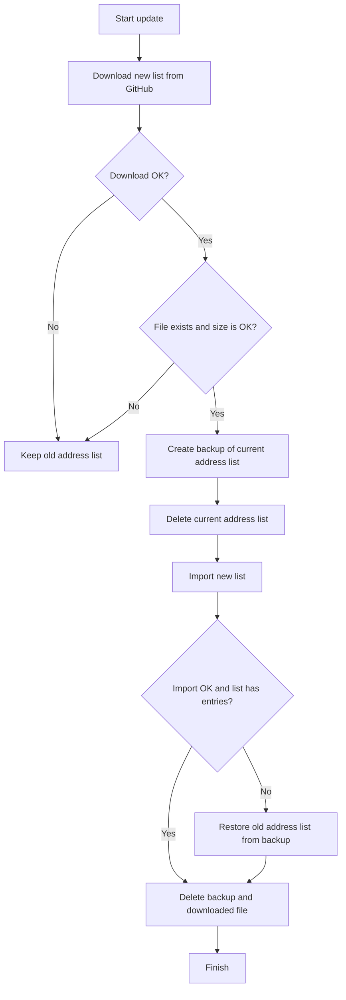

# Get IP Iran Evo for MikroTik

This repository creates MikroTik address-list files for Iran IP ranges and provides safer updater scripts for RouterOS.

The project now separates IPv4 and IPv6, and also separates the update method for small routers and medium/large routers.

## IP Data Source

The IP ranges are generated from RIPEstat country resource data for Iran:

```text
https://stat.ripe.net/data/country-resource-list/data.json?resource=IR&v4_format=prefix
```

The repository may still appear on GitHub as a fork of `MrAriaNet/Get-IP-Iran`, but the automatic update workflow does not fetch data or code from that repository.

Current update path:

```text
RIPEstat -> scripts/get.sh -> list-ipv4.rsc / list-ipv6.rsc
```

The old upstream sync workflow was removed on purpose, so the generated IP lists are updated only from the source API used by `scripts/get.sh`.

## Address Lists

| File | RouterOS address list | Purpose |
| --- | --- | --- |
| `list-ipv4.rsc` | `NoNAT` | Iran IPv4 prefixes |
| `list-ipv6.rsc` | `IRv6` | Iran IPv6 prefixes |

## Which Script Should I Use?

Use only the scripts you need.

### Recommended Safe Install

The safe install scripts fetch the updater and scheduler, import them, remove the temporary files from MikroTik disk, and run the updater once.

IPv4 small router:

```routeros
/tool fetch url="https://raw.githubusercontent.com/mohavise/Get-IP-Iran-evo/main/safe-install-iran-ipv4-small-router.rsc" dst-path=safe-install-iran-ipv4-small-router.rsc mode=https
/import file-name=safe-install-iran-ipv4-small-router.rsc
/file remove [find name=safe-install-iran-ipv4-small-router.rsc]
```

IPv4 medium/large router:

```routeros
/tool fetch url="https://raw.githubusercontent.com/mohavise/Get-IP-Iran-evo/main/safe-install-iran-ipv4-medium-large-router.rsc" dst-path=safe-install-iran-ipv4-medium-large-router.rsc mode=https
/import file-name=safe-install-iran-ipv4-medium-large-router.rsc
/file remove [find name=safe-install-iran-ipv4-medium-large-router.rsc]
```

IPv6 small router:

```routeros
/tool fetch url="https://raw.githubusercontent.com/mohavise/Get-IP-Iran-evo/main/safe-install-iran-ipv6-small-router.rsc" dst-path=safe-install-iran-ipv6-small-router.rsc mode=https
/import file-name=safe-install-iran-ipv6-small-router.rsc
/file remove [find name=safe-install-iran-ipv6-small-router.rsc]
```

IPv6 medium/large router:

```routeros
/tool fetch url="https://raw.githubusercontent.com/mohavise/Get-IP-Iran-evo/main/safe-install-iran-ipv6-medium-large-router.rsc" dst-path=safe-install-iran-ipv6-medium-large-router.rsc mode=https
/import file-name=safe-install-iran-ipv6-medium-large-router.rsc
/file remove [find name=safe-install-iran-ipv6-medium-large-router.rsc]
```

### Manual Install
### IPv4 Only

Small router:

```routeros
/tool fetch url="https://raw.githubusercontent.com/mohavise/Get-IP-Iran-evo/main/update-iran-ipv4-small-router.rsc" dst-path=update-iran-ipv4-small-router.rsc mode=https
/import file-name=update-iran-ipv4-small-router.rsc
/system script run update-iran-ipv4-small-router
```

Medium or large router:

```routeros
/tool fetch url="https://raw.githubusercontent.com/mohavise/Get-IP-Iran-evo/main/update-iran-ipv4-medium-large-router.rsc" dst-path=update-iran-ipv4-medium-large-router.rsc mode=https
/import file-name=update-iran-ipv4-medium-large-router.rsc
/system script run update-iran-ipv4-medium-large-router
```

### IPv6 Only

Small router:

```routeros
/tool fetch url="https://raw.githubusercontent.com/mohavise/Get-IP-Iran-evo/main/update-iran-ipv6-small-router.rsc" dst-path=update-iran-ipv6-small-router.rsc mode=https
/import file-name=update-iran-ipv6-small-router.rsc
/system script run update-iran-ipv6-small-router
```

Medium or large router:

```routeros
/tool fetch url="https://raw.githubusercontent.com/mohavise/Get-IP-Iran-evo/main/update-iran-ipv6-medium-large-router.rsc" dst-path=update-iran-ipv6-medium-large-router.rsc mode=https
/import file-name=update-iran-ipv6-medium-large-router.rsc
/system script run update-iran-ipv6-medium-large-router
```

## Automatic Router Updates

After importing the updater script, import the matching scheduler file.

IPv4 small router:

```routeros
/tool fetch url="https://raw.githubusercontent.com/mohavise/Get-IP-Iran-evo/main/scheduler-update-iran-ipv4-small-router.rsc" dst-path=scheduler-update-iran-ipv4-small-router.rsc mode=https
/import file-name=scheduler-update-iran-ipv4-small-router.rsc
```

IPv4 medium/large router:

```routeros
/tool fetch url="https://raw.githubusercontent.com/mohavise/Get-IP-Iran-evo/main/scheduler-update-iran-ipv4-medium-large-router.rsc" dst-path=scheduler-update-iran-ipv4-medium-large-router.rsc mode=https
/import file-name=scheduler-update-iran-ipv4-medium-large-router.rsc
```

IPv6 small router:

```routeros
/tool fetch url="https://raw.githubusercontent.com/mohavise/Get-IP-Iran-evo/main/scheduler-update-iran-ipv6-small-router.rsc" dst-path=scheduler-update-iran-ipv6-small-router.rsc mode=https
/import file-name=scheduler-update-iran-ipv6-small-router.rsc
```

IPv6 medium/large router:

```routeros
/tool fetch url="https://raw.githubusercontent.com/mohavise/Get-IP-Iran-evo/main/scheduler-update-iran-ipv6-medium-large-router.rsc" dst-path=scheduler-update-iran-ipv6-medium-large-router.rsc mode=https
/import file-name=scheduler-update-iran-ipv6-medium-large-router.rsc
```

Default schedule:

| Scheduler | Time |
| --- | --- |
| IPv4 updates | `04:00:00` daily |
| IPv6 updates | `04:10:00` daily |

You can change the scheduler time in RouterOS if another time is better for your network.

## Safety Logic

The updater scripts are designed to avoid deleting a good old address list when the new download is broken or empty.

Update flow:



## Small Router vs Medium/Large Router

### Small Router Scripts

Small router scripts keep the backup inside a temporary address list:

| Script | Temporary backup list |
| --- | --- |
| IPv4 small | `NoNAT-backup-before-update` |
| IPv6 small | `IRv6-backup-before-update` |

This avoids creating a full backup export file on disk, which is better for routers with limited storage.

### Medium/Large Router Scripts

Medium/large router scripts create a temporary backup file on router disk before replacing the list:

| Script | Temporary backup file |
| --- | --- |
| IPv4 medium/large | `nonat-ipv4-backup-before-update.rsc` |
| IPv6 medium/large | `irv6-backup-before-update.rsc` |

This is safer and cleaner for routers with enough RAM, CPU, and disk space.

The updater removes the downloaded file and backup file after a successful or failed update.

## Automatic GitHub List Updates

The repository includes a GitHub Actions workflow:

```text
.github/workflows/update-split-lists.yml
```

It runs every day and regenerates:

- `list-ipv4.rsc`
- `list-ipv6.rsc`

You can also run it manually from the GitHub Actions tab.

## Generate Lists Manually

The `scripts/get.sh` script can generate the lists from source data.

```bash
./scripts/get.sh v4
./scripts/get.sh v6
./scripts/get.sh split
```

| Command | Output |
| --- | --- |
| `./scripts/get.sh v4` | Prints IPv4 MikroTik entries |
| `./scripts/get.sh v6` | Prints IPv6 MikroTik entries |
| `./scripts/get.sh split` | Writes `list-ipv4.rsc` and `list-ipv6.rsc` |

## Notes

- IPv4 list name is `NoNAT`.
- IPv6 list name is `IRv6`.
- If download fails, the old list stays active.
- If the downloaded file is empty or too small, the old list stays active.
- If import fails, the script restores the old list.
- The scripts require RouterOS permission policy: `read,write,policy,test`.
